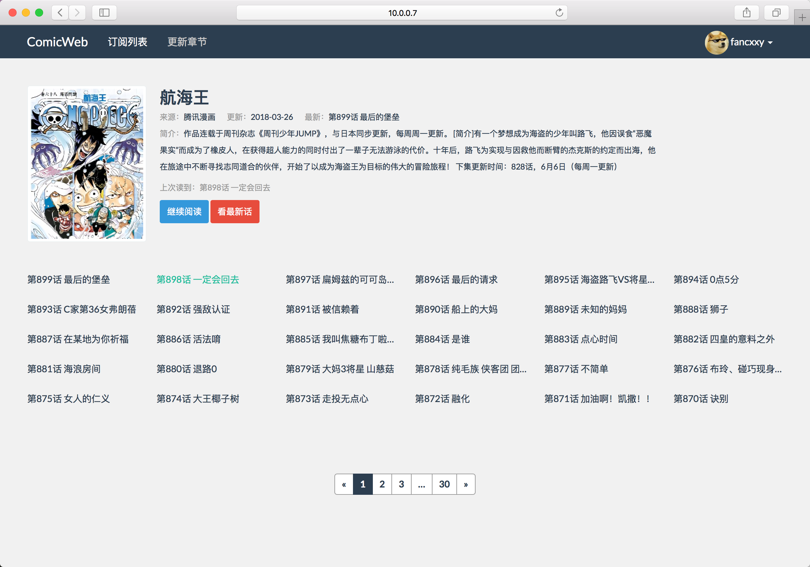

# ComicWeb

## 配置

```
$ git clone git://github.com/fancxxy/ComicWeb.git

# 安装依赖
$ pip install git+git://github.com/fancxxy/comicd.git
$ pip install -r ComicWeb/requirements.txt

# 设置环境变量，需手动修改数据库连接串 
$ source ComicWeb/env.sh

# 升级数据库
$ flask db init
$ flask db migrate -m "initial commit"
$ flask db upgrade

# 运行
$ flask run --host 0.0.0.0 --port 5000
```

## 截图





